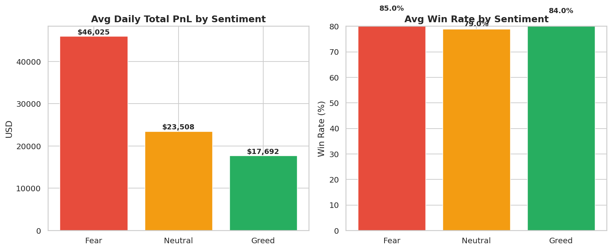

# Crypto Trader Sentiment Analysis

> Traders tend to generate higher returns during Fear-driven markets, suggesting volatility creates opportunity rather than just risk.

---

## Overview

This project explores how market sentiment (Fear vs Greed) affects trader performance and behavior.

Using historical trading data along with the Fear & Greed Index, the analysis looks at patterns in PnL, trading activity, and leverage under different market conditions.

The dataset covers May 2023 to May 2025, with over 100,000 trades across 32 traders.

---

## Setup

Install dependencies:

```
pip install pandas numpy matplotlib seaborn scikit-learn jupyter
```

Run the notebook:

```
jupyter notebook trader_sentiment_analysis.ipynb
```

Or run the script:

```
python analysis.py
```

---

## Methodology

Both datasets were loaded and checked. There were no missing values or duplicates.

Dates from the trading data were aligned with the Fear & Greed Index so each day could be assigned a sentiment.

The sentiment values were grouped into three categories:

- Fear (including Extreme Fear)  
- Neutral  
- Greed (including Extreme Greed)  

Key metrics were then calculated, including daily PnL, win rate, number of trades, position size, and a simple leverage proxy.

Traders were also segmented into groups like net winners and net losers to compare behavior.

---

## Key Insights

- Fear days show much higher average PnL compared to Greed days (around 2.6× higher)  
- Trading activity increases during Fear periods, with more trades, higher leverage, and larger position sizes  
- Net losing traders perform significantly worse during Greed periods  
- Net winning traders remain consistently profitable across different sentiment conditions  

---

## Strategy Takeaways

- Fear periods seem to offer better opportunities, but also involve higher risk  
- Greed periods require more discipline, as overtrading is linked with higher losses  

Simple takeaway:

- Be more active during Fear  
- Be more cautious during Greed  

---

## Sample Output



---

## Outputs

The project generates multiple charts showing performance and behavior across sentiment conditions.

All charts are saved in the `charts/` folder and can be reproduced by running the analysis script.

---

